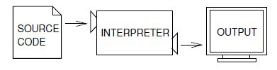
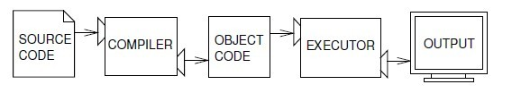

# <a name="The-way-of-program"></a> 第一章 编程方式

本书的目的是教你如何像一个计算机科学家一样思考。这种方法结合了数学、工程、自然科学的思考方式，让你像数学家，计算机科学家使用专业术语来表达观点（特别是计算）。例如工程师，设计产品，把零件组装成系统，在可选择的方案之间的权衡得失和评估方案。像科学家一样，观察复杂系统的运作，形成假设，并验证自己的预测。

一个计算机科学家最重要的一项技能是解决问题。解决问题意味着确切地阐述问题的能力，意味着有创造性地思考解决方案的能力，还有准确清晰的表达一个解决方案的能力。事实证明，学习编程的过程是一个极好的练习解决问题技能的机会。这就是为什么这一章叫做“编程的方式”。

在一个层面上来讲，你将学习到的编程，本身就是一个有用的技能。另一方面，你将通过编程达到你的目的。我们越往后走，道路会变得越发清晰。

## <a name="1.1-The-Python-programming-language"></a> 1.1 Python编程语言

你将学习的编程语言是Python。Python是高级语言中的一种，其他你可能听说的高级语言还有C，C++，Perl，Java。

除此之外，还有低级语言，有时称为 __“机器语言”__ 或 __“汇编语言”__ 。一般来说，电脑只能运行低级语言。所以在高级语言编写的程序必须经过处理才可以运行。这个额外的处理步骤需要一定的时间，这是高级语言的一个很小的缺点。

但高级语言的优势是巨大的。首先，高级语言更易于编写。用高级语言编写的程序使得编写程序的时间大大减少，他们更短、更容易阅读，他们更容易写对的。第二，高级语言非常方便，这意味着他们可以在很少修改或没有修改的情况下在不同的机器上运行。而低级程序只可以在一种计算机上运行，如果要换机器，就必须重新编写。



图1.1: 解释的过程是每次解释一部分，交替、轮流地读取信息，并执行计算。



图1.2: 一个编译器的源代码转换成目标代码，这是由硬件执行的。

由于这些优点，几乎所有的程序都是用高级语言编程的。低级语言是只用于一些特殊的应用。

__解释器__ 和 __编译器__ 都可以将高级语言处理成低级语言的。

解释器读取高级语言程序，并执行它，这意味着亦步亦趋，照搬不误。它每次处理程序的一小部分，轮流读取和计算。图1.1显示了解释器的结构。

编译器读取程序并在程序开始运行之前将它完全转化。在这种情况下，高级语言程序被称为源代码，编译后的程序被称为目标代码，即可执行对象。一旦程序被编译，你可以执行而无需进一步的翻译。图1.2显示一个编译器的结构。

Python 是一种解释性语言，因为 Python 是通过解释器解释执行。Python 提供两种使用方式：__交互模式__ 和 __脚本模式__  。在交互模式中，你可以直接输入 Python 命令，解释器将立即返回结果：
    
```Python
>>> 1 + 1
2
```

`>>>`，是一个指示。翻译器用它来表明准备就绪。如果你输入`1+1`，那么解释器就会返回2。

另外，你也可以把代码输入到文件中，并使用解释器来执行文件内容，这个文件被称为脚本。按照惯例，Python脚本文件扩展名为`py`。
要执行脚本，你必须告诉解释器文件的名称。如果你有一个脚本叫做 dinsdale.py。你在一个UNIX命令窗口进行操作。你应该输入`Python dinsdale.py`。在不同的开发环境中，执行脚本的细节是不同的。你可以在以下网址找到适合您的环境的操作指南：http://python.org.

在交互模式下操作，方便你测试一些短的代码，因为你可以立刻执行它们。但是任何超过几行的代码，你都应该保存为一个脚本，才可以在以后方便修改并执行它。

## <a name="1.2-What-is-a-program"></a> 1.2 程序是什么？

程序是一系列执行计算机如何进行计算的指令。计算可能是进行一些数学化的活动，如解方程组或找到一个多项式的根，但它也可以是一个符号计算，如搜索或替换文本文档、编译程序。

不同的编程语言里细节不同，但一些基本的指令出现在几乎所有的语言：

*  __输入__ ：从键盘、文件或一些其他的设备中取得数据。
*  __输出__ ：在屏幕上显示的数据或发送数据到一个文件或其他设备。
*  __数学__ ：执行基本的数学运算，如加法和乘法。
*  __条件执行__ ：检查确定的条件和执行适当的代码。
*  __重复__ ：重复执行某些操作，通常有一些变化。

信不信由你，几乎就只有这么多了。你使用过的每个程序，无论多么复杂，都是由类似于这些的指令组成的。所以你可以把编程过程复杂的任务分成更简单的子任务，直到任务简单到可以实现一种基本的指令。
这可能有点模糊，但我们谈论算法的时候会回到这个话题的。

## <a name="1.3-What-is-debugging"></a> 1.3 什么是调试？

编程是很容易出错的。由于古怪的原因，程序错误被称为 __bugs__ 。寻找 bugs 的过程被称为调试。

程序中的错误划分为三种：
  1. 语法错误(syntax errors)
  1. 运行时错误(runtime errors)
  1. 语义错误(semantic errors)
明确地区分错误类型，可以帮助你快速地追踪到 bugs .

### <a name="1.3.1-Syntax-errors"></a> 1.3.1 语法错误

Python 只有在语法完全正确的情况下才可以执行程序。否则解释器将显示错误消息。 __语法(Syntax)__ 是指一个程序结构以及有关这些结构的规则。例如，括号必须配对，所以 `(1 + 2)` 是合法的，但 ` 8)` 会引起 __语法错误(Syntax)__ 。

英国读者可以排序大多数语法错误 _which is why we can read the poetry of
e. e. cummings without spewing error messages._ (好吧我不知道应该怎么翻译了= =)。

Python 并不那么仁慈。如果程序中存在一个语法错误，Python 将显示错误信息并退出程序，你无法运行你的程序。在你的编程生涯头几个星期，你可能会花很多时间寻找语法错误。随着经验的增加，你会少犯错误并能够快速地找到语法错误。

### <a name="1.3.2-Runtime-errors"></a> 1.3.2 运行时错误

第二类错误是运行时错误，因为这种错误要到程序开始运行后才会出现。他们通常出现一些不好而且不同于想象的错误，所以这些错误也被称为 __异常(Exception)__ 。

运行时错误在在前几章的简单的程序是很罕见的，所以你暂时还不会碰到。

### <a name="1.3.3-Semantic-errors"></a> 1.3.3 语义错误

第三种错误是语义错误。即使你的程序存在语义错误，程序执行过程也不会提示任何错误信息。但是它不会按照你所预想的情况执行，而改做其他的事情。具体地说，它会做你告诉他要做的事情。

这种问题出现的原因是你所写的程序并不是你所想要写的程序，也许是在某个地方写错了，所以它达不到你想达到的目的。识别语义错误是很棘手的，它要求你回头看程序的输出，并从中找出它在做什么，错误出在哪里。

### <a name="1.3.4-Experimental-debugging"></a> 1.3.4 实验调试

你需要的一个最重要的技能是调试。虽然调试会令人沮丧，但调试是编程过程中最具挑战以及有趣的部分。

在某些方面，调试像侦探工作。你将遇到一些线索，根据它们推断程序执行的过程或者你所看到的结果。

调试也像是实验科学。一旦你发现了引起错误的地方，可以对它进行修改并重新执行一次。如果你的假设是正确的，那么你可以预测改进的结果，那么你离一个可以工作的程序又更近了一步。如果你的假设是错误的，你要拿出一个新的方案。就像福尔摩斯指出，“当你排除了那些不可能的，不论剩下什么，看起来有多么不可能，它就是真理”。(A. Conan Doyle, _The Sign of Four_ )

对于一些人来说，编程和调试是一样的。他们认为，编程是逐步调试程序的过程，直到程序按照你所想要的方式执行。意思是说，你开始编程，然后通过一步步小的修改，经过一次次的调试，就能得到可以工作的程序。

例如，Linux 包含了成千上万行代码，但是最初的时候，Linux 系统是 Linus Torvalds 利用它来探索 Intel 80386 芯片的一个简单程序。据 Larry Greenfield 说：“Linus 的早期项目是一个只能在 AAAA 和 BBBB 之间切换的程序，后来演变为Linux。” ( _The Linux Users' Guide_ Beta Version 1)

在后面的章节将会给出调试和其他编程实践的建议。

## <a name="1.4-Formal-and-natural-languages"></a> 1.4 形式语言和自然语言
__自然语言(Natural language)__ 是人们用来交流的语言，例如英语、西班牙语、法语。这些语言不是由人们设计的（虽然人们会加入固定用语），他们自然进化。

__形式语言(Formal language)__ 为特定应用程序设计的语言。例如，数学家使用的符号就是一种形式语言，特别擅长表示数字和符号之间的关系。化学家使用形式语言来表示分子的化学结构。然而最重要的是: __编程语言是一种被设计来表达计算的形式语言__。

形式语言有严格的语法规则。比如说，3 + 3 = 6 是一个语法正确的数学表述。但是 3 + 3 = 6$ 就不是。H2O是一个语法正确的化学式，但2Zz不是。

语法规则有两种形式，属于符号和结构。符号是基本的的语言元素，如文字，数字，和化学元素。其中的一个问题 3 + 3 = 6$ 中的 $ 在数学中是不合法的符号（至少就我知道的而言）。同样的，2Zz 也不是合法的符号，因为没有简称为 Zz 的化学元素。

语法规则的第二类型是语句结构；即，符号的排列方式。语句 3 + = 3 是非法的，即使因为 “+” 和 “=” 是合法的，但是他们没有正确的排列方式。同样地，化学元素的下标位于元素名称后方，而并非前方。

_练习1.1写一个符号无效、结构有效的英语句子。然后写一句符号有效，但结构无效的句子。_

当你读英语句子或一种形式语言的语句，你必须理解句子的结构是什么（尽管在你读自然语言的时候是下意识这样做的）。这个过程被称为解析。

例如，当你听到这句话 “The penny dropped”，明白了，你明白“penny”为是主语，“dropped”是谓语。一旦你解析一个句子，你就会明白它的意思，或是句子的语义。如果你知道“penny”代表着什么，“drop”意味着什么，那么你会理解这句话的含义。

虽然形式语言与自然语言都具有许多共同的符号，但许多功能，结构，语法和语义，存在一定的差异：

__二义性(ambiguity)__ ：自然语言拥有二义性，人们要解析它需要根据上下文线索和其他信息。形式语言的设计是近乎完全明确的，这意味着任何语句都有一个意思，无须牵扯上下文。

__冗余(redundancy)__ ：为了弥补歧义和减少误解，自然语言使用了大量的冗余。因此，他们往往冗长。形式语言冗余较少，更简洁。

__无修饰(literalness)__ ：自然语言里有很多成语和比喻。如果我说，“The penny dropped”.很有可能没有“便士”，也没有什么东西掉了。（这句成语的意思是，有人在一个混乱的时期之后认识到的东西）。而形式语言则说一不二，只代表“便士掉了”这件事情本身。

一个习惯说自然语言的人，往往很难适应形式语言。在某些方面，形式语言和自然语言之间的差别是诗与散文的区别，但更多的是：
1. __诗(Poetry)__ ：字词，用其读音与意义，使整个诗歌创造出一个效果或一种情绪反应。歧义不仅仅是常见的，而且是作者故意而为之的。
1. __散文(Prose)__ ：词的字面意义是重要的，结构也赋予了它更多的意义。散文比起诗歌来更容易分析与掌握，但有时意思依然会模棱两可。
1. __程序(Programs)__ ：计算机程序的含义是清楚明白的，并可以通过对符号和结构的分析完全理解。

这里有一些阅读程序（和其他语言）的建议。首先，请记住，正式的语言比自然语言更为密集，所以它需要更长的时间来阅读他们的。同时，程序的结构是非常重要的，所以通常从上往下读、从左到右读不是一个好主意。相反，要学会在头脑中从语法上描述或分析程序，识别符号和解析结构。最后是细节问题。在拼写和标点等小的错误上，你可以在使用自然语言的时候侥幸逃脱的错误，却会使正式的语言发生很大的变化。

## <a name="1.5-The-first-program"></a> 1.5 第一个程序

在传统上来说，你用一种新的语言写的第一个程序，被称为“Hello，World!”。它的作用是显示“Hello, World!”。在Python中，它看起来像这样：
        >>> print 'Hello, World!'
这是一个 `print` 语句的示例，它实际上不打印任何东西在纸上了，而是在屏幕上显示一个值。在这种情况下，显示的是：
        Hello, World!
在程序里的引号，用于标记文本的开始与结束，它们不会显示在结果中。

在 Python 3中，印刷语法有些不同：
        print('Hello, World!')
圆括号表明 `print` 是一个函数。我们会在第3章学习这一个函数。

在本书的其余部分，我将使用 `print` 语句（译者注：而不是作为函数）。如果你在使用 Python 3，你需要自行转换。除此以外将很少出现差异，我们不必担心。

## <a name="1.6-Debugging"></a> 1.6 调试

在电脑前读这本书是个好主意，你可以一边看书一边去尝试那些例子。你可以在交互模式中运行大多数的例子。但如果你把代码放在一个脚本中，它将更容易尝试不同的变化。

每当你试验一种新的功能，你应该尝试着去犯错误。

例如，在 “Hello, world!” 程序中，如果你少打了一个引号，会发生什么？如果你两个引号都没有打呢？如果你将 print 拼错了呢？

这种实验可以帮助你记住你所读到的东西；因为你了解错误信息是什么意思，所以它也对调试有帮助。现在故意犯下的错误总比以后因为不小心而突然出现的错误要好得多。

编程，特别是调试，有时带来了强烈的情绪影响。如果你正艰难地修复一个难以解决的 bug，你可能会感到愤怒，沮丧或者尴尬。

人们显然习惯当电脑能够很好地帮我们解决问题的时候把它当作我们的朋友，而当电脑无法解决我们想要解决的问题的时候，粗鲁地对待它。( __Reeves and Nass__ , 
_The Media Equation: How People Treat Computers, Television, and New Media Like Real People and Places_ ).

考虑上这些情绪因素，可以帮你解决它们。把电脑作为一个雇员，他的优点是具有有保障的快速和精度，但同时他缺乏同情心以及不能对大局有所把握。

你的工作是做一个好的管理者：寻求利用优势和减少弊病的方法，并找到方法来使你的情绪参与解决问题,而非干扰到你高效的工作能力。

调试可以令人沮丧，但它是一个有价值的技能，许多价值超越了编程本身，都是很有用的。在每章的末端有一个调试部分，就像现在这个部分，都是些我关于调试的想法。我希望它们能帮到你！

## <a name="1.7-Glossary"></a> 1.7 术语
 * __解决问题(problem solving)__ ：制定问题的过程，寻找解决方案和表达解决方案。
 * __高级语言(high-level language)__ ：一类类似 Python 的语言，方便人的阅读与编写。
 * __低级语言(low-level language)__ ：一种被设计成方便计算机执行的语言，又称为“机器语言”、“汇编语言”。
 * __可移植性(portability)__ ：程序能够在多个平台上运行的属性。
 * __解释(interpret)__ ：一次一行地执行高级语言程序。
 * __编译(compile)__ ：一次性将高级语言翻译为机器语言，以便以后的执行。
 * __源代码(source code)__ ：高级语言所编写的程序编译前的代码。
 * __目标代码(object code)__ ：编译器编译之后的程序代码。
 * __可执行文件(executable)__ ：准备被执行的程序。
 * __命令提示符(prompt)__ ：解释器根据用户的输入所显示的用户可能想要输入的关键词。
 * __脚本(script)__ ：存储在一个能够被解释器解释的文件里的程序。
 * __交互模式(interactive mode)__ ：在命令提示符中输入命令，由 Python 解释器解释执行的方式。
 * __脚本模式(script mode)__ ：通过读取脚本文件执行程序语句的方式。
 * __程序(program)__ ：一系列指定如何执行计算的指令。
 * __算法(algorithm)__ ：一个用于解决一类问题的通用流程。
 * __bug__ ：程序里的错误。
 * __调试(debugging)__ ：寻找并且修复三种类型的程序错误的过程。
 * __语法(syntax)__ ：程序结构。
 * __语法错误(syntax error)__ ：程序中使得编译器（或者解释器）无法解析的错误。
 * __异常(exception)__ ：在程序运行过程中被探测出来的错误。
 * __语义(semantics)__ ：程序的意义。
 * __语义错误(semantics error)__ ：使得程序无法按照意愿执行的错误。
 * __自然语言(natural language)__ ：人类沟通所使用的能够自然进化的语言。
 * __形式语言(formal language)__ ：任何一种为某种目的而设计的语言。例如表达数学思想或者计算机程序。所有编程语言都是形式语言。
 * __符号(token)__ ：程序句法结构中的一个基本的元素，类似于自然语言中的一个词。
 * __解析(parse)__ ：检查并且分析程序的语句结构。
 * __print 语句(print statement)__ ：一条使 Python 解释器在屏幕上输出值的命令。