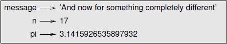

#  第二章 变量、表达式和语句

##  2.1 变量值与类型

值是程序中的基本元素, 像一个字母或一个数字. 到目前为止我们所看到的值是像 1, 2 和 `Hello, world!` 这样的。

这些值属于不同的类型: 2是整数,而 `Hello, world!` 是一个字符串,之所以这样说, 是因为它包含一个 “串” 的字母。你(和解释器)可以识别字符串,因为他们是被括在引号中的。

如果你不确定某个值是什么类型的,解释器可以告诉你。例如：

    >>> type('Hello, World!')
    <type 'str'>
    >>> type(17)
    <type 'int'>

很明显，“Hello,world!” 属于字符串（string），而 17 属于整数(integer)。比较不容易区分的是，带小数点的数字属于 float 的类型,因为这些数字是以一种称为 `floating-point` 的格式呈现的。

   >>> type(3.2)
   <type 'float'>

那么，值 `'17'` 和 `'3.2'` 呢？虽然他们看起来像数字，但其实是字符串。（因为他们都被括在引号中）

    >>> type('17')
    <type 'str'>
    >>> type('3.2')
    <type 'str'>

当你输入一个较大的整数时, 你可能会试图用逗号间隔三位数,例如 `1,000,000`, 这在 Python 中是不合法的整型数字，但它这样是合法：

    >>> 1,000,000
    (1, 0, 0)

好吧, 这个根本不是我们所期望的东西. Python 解释器将 1,000,000 作为一个逗号分隔的整数序列. 在第一个例子中, 我们已经看到一个语义错误: 代码运行时没有产生错误消息, 但是它却没有做该做的事情。

##  2.2 变量

编程语言最强大的一种功能是能够操纵变量. 变量是一个指向一个值的名称. 一个赋值语句创造新的变量，并且给他们值:

    >>> message = 'And now for something completely different'
    >>> n = 17
    >>> pi = 3.1415926535897932

这个例子有三个赋值, 第一个例子为一个命名为 `message` 的字符串赋予新变量, 第二个例子为 `n` 赋值 `17` , 第三个例子为 `pi` 赋予 π 的（约）值.

一种常用来在至上表示变量的方法是一个从变量名指向变量值的箭头. 这种图称为状态转换图, 因为它显示了每个变量的状态是在(想象一下这是变量的内在状态). 图2.1显示了前面示例的结果。

变量的类型就是它所指向的值的类型：

    >>> type(message)
    <type 'str'>
    >>> type('n')
    <type 'int'>
    >>> type(pi)
    <type 'float'>

练习2.1 如果你输入一个以0开始的整数, 你可能会得到一个令人困惑的错误:

    >>> zipcode = 02942

    SyntaxError: invalid token

其他数字却可行, 但实际结果却很奇怪

    >>> zipcode = 02132
    >>> zipcode
    1114

你能解释这是什么原因么? 提示: 试着输出 01, 010, 0100 和 01000.

##  2.3 变量名与关键词

程序的变量名通常选择一个对变量的用途相关的名字. 变量名可以任意长. 它能够包含字母和数字, 但必须以字母开头. 你也可以使用大写字母, 但是选择以小写字母开始对你来说更明智(后面会告诉你为什么). 下划线 `_` 也可以出现在名字里, 它通常用在多个单词的变量名中, 例如 `my_name` 和 `airspeed_of_unladen_swallow` .

如果用一个不合法的变量名, 你会得到一个语法错误:

    >>> 76tromones = 'big parade'
    SyntaxError: invalid syntax
    >>> more@ = 1000000
    SyataxError: invalid syntax
    >>> class = 'Advanced Theoretical Zymurgy'
    SyntaxError: invalid syntax

`76trombones` 不合法是因为它不是以一个字母开头的. `more@` 不合法是因为它包含一个不合法的字符 `@` . 但是 `class` 又有什么问题呢? 这是因为 `class` 是 Python 的一个关键词. Python 解释器把它当成关键词来理解程序的结构, 所以他们不能被用于名字.

Python 2 一共有 31 个关键词:

    and del from not while
    as elif global or with
    assert else if pass yield
    break except import print
    class exec in raise
    continue finally is return
    def for lambda try

在 Python 3 中, `exec` 不在是关键词, 但 `nonlocal` 加入了关键词行列.
你可能需要随时查阅上面的列表. 如果解释器对你的变量名有意见, 你可以翻出来, 看看变量名是否在上面的列表中.

##  2.4 操作符与操作数

操作符是用来表示像加号和乘号这样的计算的特定符号. 被操作符所应用的值被称为 `操作数` . 操作符 `+`, `-`, `*`, `/` 和 `**` 分别表示加, 减, 乘, 除和乘方, 例如下面的一些例子:

    20 + 32
    hour - 1
    hour * 60 + minute
    minute / 60
    5**2
    (5 + 9) * (15 - 7)

在其他的编程语言中, `^` 被用于乘方, 但是在 Python 中, 它是位操作符, 称为 XOR (位异或). 在本书里没有关于位操作符的一些说明, 但你可以在 [http://wiki.python.org/moin/BitwiseOperators](http://wiki.python.org/moin/BitwiseOperators.) 中获得相关信息.

在 Python 2 中, 除法操作符可能不像你所想象的那样:

    >>> minute = 59
    >>> minute/60
    0

`minute` 的值是 59, 并且在传统计算中 59 除以 60 为 0.98333, 而不是 0.

产生这个偏差的原因是 Python 执行的是"地板除"(floor division), 它会砍掉小数部分, 所以在这个例子中, 它的结果会编程 0.

而在 Python 3 中, 除法的结果是浮点型. 而新的操作符 `//` 则表现为 _地板除_ .

如果其中一个操作数是浮点型, Python 将执行浮点型除法, 并且计算的结果也是浮点型:

    >> minute / 60.0
    0.98333333333333328

##  2.5 表达式与语句

表达式是值, 变量还有操作符的组合. 一个值或是一个变量也被认为是表达式, 所以下面是合法的表达式 (假设变量 x 已经被赋值):

    17
    x
    x + 17

一条语句是能够被 Python 解释器执行的一组代码. 我们已经看过两种语句: `print` 和赋值语句. 科学地来说, 一个表达式也是一条语句, 但它很容易区分它们两者. 最重要的不同是一个表达式一定拥有一个值, 而表达式不一定.

##  2.6 交互模式与脚本模式

解释性语言的一个好处是你能够在代码放入脚本之前, 先在交互模式下测试代码. 但这两者的区别可能会使你迷茫.

举个例子, 如果你将 Python 当作计算器使用, 你可能输入: 

    >>> miles = 26.2
    >>> miles * 1.61
    42.182

 第一行是赋值给 `miles`, 但是它没有可视的效果. 第二行是一个表达式, 所以解释器计算它, 并且显示结果. 所以我们可以知道一场马拉松比赛大概需要跑 42 千米. 但是如果你将同样的代码输入到一个脚本中, 并且运行它, 你根本看不到输出结果. 在脚本模式中, 一个表达式是不会产生可视的效果的. Python 实际上计算了表达式的值, 但它不会显示出来, 除非你要它这么做:

    miles = 26.2
    print miles * 1.61

这一行为在一开始可能会让你感觉困惑.

一个脚本通常含有一些列的语句. 如果这里有多余一条语句, 在语句执行的同时结果会一条条地显示出来.

    print 1
    x = 2
    print x

输出的结果:

    1
    2

赋值语句不会产生输出.

_练习2.2_ : 在 Python 解释器中输入下列的语句, 看看会发生什么事:

    5
    x = 5
    x + 1

现在将同样的语句放在一个脚本文件中, 并且运行它. 输出又是什么?

将脚本文件中的每一个表达式换成一条 print 语句, 再运行一次?

